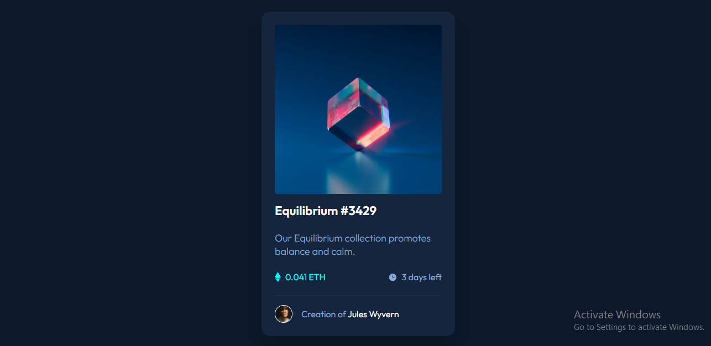

# NFT Preview Card Component | Frontend Mentor

This is a solution to the NFT Preview Card Component challenge on Frontend Mentor. It is a simple and responsive card component showcasing an NFT item with hover effects and clean UI design.

---

## Table of Contents

- [Overview](#overview)
  - [The Challenge](#the-challenge)
  - [Screenshot](#screenshot)
  - [Links](#links)
- [My Process](#my-process)
  - [Built With](#built-with)
  - [What I Learned](#what-i-learned)
  - [Continued Development](#continued-development)
- [Author](#author)

---

## Overview

### The Challenge

Users should be able to:

- View the NFT card component with proper layout
- See hover states for interactive elements (image overlay, text, etc.)
- Experience a responsive design across different screen sizes

---

### Screenshot

---

### Links

- Repository:  https://github.com/IrfanAnsari21/nft-preview-card-component.git

- Live Site:  https://irfanansari21.github.io/nft-preview-card-component/

---

## My Process

### Built With

- Semantic HTML5
- CSS3

---

### What I Learned

- Creating reusable card components
- Working with hover effects and overlays
- Improving layout alignment using Flexbox
- Writing cleaner and more structured CSS
- Enhancing UI design with small details

---

### Continued Development

- Improve accessibility (focus states, semantic roles)
- Add more animations for better UX
- Refactor code for better reusability
- Enhance responsiveness for edge cases

---

## Author

- GitHub:  [@IrfanAnsari21](https://github.com/IrfanAnsari21)  

- Frontend Mentor:  [@IrfanAnsari21](https://www.frontendmentor.io/profile/IrfanAnsari21)

---

## Acknowledgments

Thanks to **Frontend Mentor** for providing this challenge to improve real-world frontend skills.